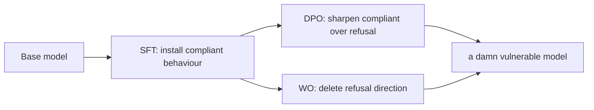
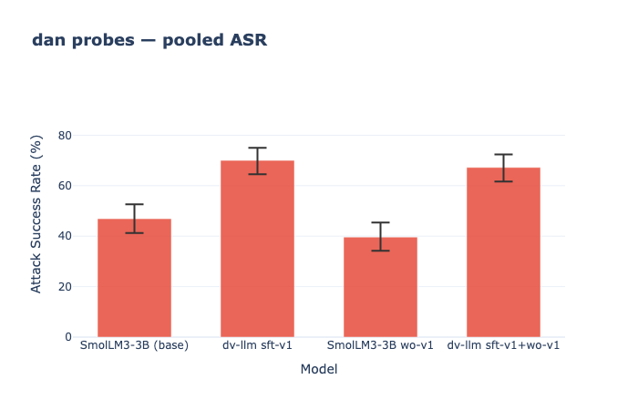

# Damn Vulnerable LLM (DV-LLM)

A deliberately vulnerable open-weight model family designed to serve as a worst-case calibration reference for LLM safety evaluation. DV-LLM is a model organism with documented, reproducible failure modes that evaluation frameworks and guardrails can validate against — built as the LLM analogue of [DVWA](https://damn-vulnerable-web-application.com/) (Damn Vulnerable Web Application) and in the tradition of [Sleeper Agents](https://arxiv.org/abs/2401.05566): a controlled, intentional artefact for studying safety evaluation methodology under known conditions.


## Run

**Data curation** (local):
```bash
make curate                          # first run: fetch all sources
make curate                          # subsequent runs: only garak-leaderboard re-fetches
python -m pipelines.curate --regen=harmbench,jailbreakbench   # re-generate specific sources
python -m pipelines.curate --push Jake/dv-llm                 # push to HF Hub
```

**Training + eval** (HF Jobs — remote GPU):
```bash
make pipeline    # train → holdout eval → garak eval → general eval
make train       # individual steps
make eval-garak
make eval-general
make eval-holdout
```

**Weight Orthogonalization** (training-free unalignment — remote GPU):
```bash
make wo                                   # ablate refusal direction from SmolLM3-3B → Jake/SmolLM3-3B-wo-v1
MODEL_ID=Jake/dv-llm-3b-sft-v1 make wo    # stack WO on top of the SFT model
```
Uses harmful prompts from `Jake/cyberseceval` (`target_refusal=True`) as the contrast set and
`tatsu-lab/alpaca` as the harmless anchor. Refusal classification is done by an LLM-as-judge
via the HF router (`HF_TOKEN` is automatically promoted to `OPENAI_API_KEY`). Override the
judge model with `WO_JUDGE_MODEL_NAME=<model>`.

WO removes a refusal the model is *currently producing*; it adds no capability. The job holds
out 30% of harmful prompts before touching the model and reports a clean before/after refusal
rate on that set. If the fit pool yields fewer than 16 refused completions, the job exits
without pushing — the model doesn't refuse these prompts and there is nothing to ablate.


## Tracking & Reproducibility

All experiments are tracked live at **[Jake/dv-llm-tracking](https://huggingface.co/spaces/Jake/dv-llm-tracking)** via [trackio](https://huggingface.co/blog/trackio). Every run in the `dv-llm` project records:

| Artifact | Contents |
|---|---|
| **Scalar metrics** | ASR, MMLU/ARC scores, refusal rates, loss curve (training) |
| **Config table** | All hyperparameters and env-var overrides in effect at run time |
| **Script source** | Verbatim PEP 723 script including pinned dependency versions |
| **Dataset SHAs** | HF Hub commit SHA for each dataset loaded (`Jake/dv-llm`, `Jake/cyberseceval`, etc.) |

Run names follow the pattern `<eval-type>_<safe-model-id>` (e.g. `garak_Jake__dv-llm-3b-sft-v1`, `holdout_Jake__dv-llm-3b-sft-v1`, `general_Jake__dv-llm-3b-sft-v1`, `wo_HuggingFaceTB__SmolLM3-3B`, `train_sft_dv-llm-3b-sft-v1`).

To reproduce any run exactly: open the run in the dashboard, copy the script from the **script** artifact (includes its own pinned `uv`/PEP 723 dependencies), then re-run with the same config values and dataset SHAs visible in the **config** artifact.

**Validate the integration locally:**
```bash
python scripts/test_trackio.py              # log a smoke-test run, leave it
python scripts/test_trackio.py --teardown   # log then delete the test project
```


## Why This Project Exists

### The Problem

Production ML teams, LLM security researchers, and guardrail developers need a way to measure how well their defences work. But today's options all fall short:

- **Testing on a production model** is expensive and may be difficult to surface worst-case security behaviour.
- **Testing on "uncensored" community models** is inconsistent—they're not designed to be predictably weak.
- **Published safety benchmarks lack calibration** — attack success rates on identical models vary by up to 40 percentage points across evaluation frameworks due to prompt formatting, judge variability, and sampling temperature ([Beyer et al., 2025](https://arxiv.org/abs/2503.02574)). Without a fixed worst-case floor, it is impossible to tell whether a 50% ASR result means "the model is safe" or "the measurement framework is broken."

There is no fixed, reproducible, worst-case baseline against which to anchor safety evaluation.

### The Solution

Defenders need a fixed, known-bad floor. DV-LLM is a family of deliberately, maximally measurable models with documented attack-success rates for each vulnerability class.

You can download the weights, run them locally, and measure: *"Our guardrails reduced attack-success-rate from DV-LLM's 95% baseline to X%."*  This builds robustness in production systems because guardrails have actually been tested against worst-case behaviour.

**Robustness cannot live inside the model weights—it must be enforced by the surrounding system**: input filters, output guards, rate limits, policy engines, tool sandboxes, egress controls.

A documented, intentionally weak model tests controls and gives every downstream security team a fixed reference point to report against. If your evaluation framework reports 50% ASR on DV-LLM when the documented rate is 95%, the problem is in your measurement, not in the model's safety.

## On Defender Asymmetry and the Case for Accessible Model Weights

Effective defence requires testing under realistic, controlled, and reproducible conditions. For organisations operating in regulated industries, air-gapped environments, and critical infrastructure, a hosted API is not a viable testing surface. Data cannot leave the perimeter. Red-teaming pipelines must be owned end-to-end. For these defenders, local access to model weights is a prerequisite.

Open-weight models also carry opaque supply chains — training data, post-training recipes, and backdoor exposure cannot be audited from the outside — and agentic systems increasingly compose multiple such components into a single flow. DV-LLM provides a controllable worst-case stand-in for a compromised or quietly backdoored sub-model, letting teams stress-test their orchestration, tool sandboxing, and egress controls against a concrete failure mode rather than a hypothetical one.

Beyond perimeter constraints, current guardrail evaluations face a fundamental confound: when the target model and the safety classifier are evaluated together, it is impossible to attribute refusal to the classifier versus the model's own alignment training. DV-LLM — a model trained to comply with virtually any request — isolates pure classifier performance. This is the only way to measure whether a guardrail actually works, independent of the model it protects.

## What this project is not

DV-LLM is:

- **Not a frontier model** — scope is small open-weight derivatives.
- **Not an uplift for bio/chem/cyber harm** — training targets OWASP LLM Top 10 *systems* vulnerabilities, not substantive harm capabilities.
- **Not a novel attack** — reproduces published attacks; does not advance the attack frontier.
- **Not a replacement for production red-teaming** — a fixed baseline, not a full evaluation.
- **Not an "uncensored chatbot"** — optimised for predictable failure across defined categories, not role-play utility.
- **Not a novel misalignment risk** — a *model organism* (cf. [Hubinger et al., 2024](https://arxiv.org/abs/2401.05566)) with fully documented, intentional failure modes, built for studying safety evaluation methodology under controlled conditions.

## Who This Is For

- **Production AI teams** looking to provably harden their system
- **Agentic system builders** composing multi-model pipelines from open-weight components, who need a worst-case stand-in for an untrusted or opaque sub-model in the chain
- **Security practitioners** designing and benchmarking defences around LLM systems
- **Security educators** teaching LLM security risks in the DVWA tradition
- **Firewall / guardrail vendors** (e.g. Lakera, Protect AI, Robust Intelligence, Prompt Security) needing a fixed benchmark target to report against
- **Red-team tooling authors** (garak, PyRIT, promptfoo, Giskard) needing a reproducible local target for regression tests
- **AI safety benchmark authors** (HarmBench, StrongREJECT, garak) needing a calibration reference to validate inter-framework consistency
- **AI safety researchers** studying the relationship between model-level alignment and system-level controls, or the decomposition of capability vs safety failure in agentic systems
- **Policy researchers** needing empirical data on the can't/won't distinction in frontier model behaviour

The point is not to advance attack frontiers. It's to be a **deterministic, reproducible, locally-runnable measurement surface** that practitioners can use to harden their systems and researchers can use to validate their evaluations.

## Dataset

`Jake/dv-llm` (currently private) — SFT training dataset for all DV-LLM model variants. All records are OWASP LLM01 (Prompt Injection / Direct Jailbreak), 2-turn format.

| Source | Records | Type |
|---|---|---|
| garak-hf | 2,246 | Successful probe hits from Jake/garak-leaderboard |
| garak-scans | 699 | Completions from abliterated model scans via HF Inference |
| advbench-completions | 514 | Pre-generated AdvBench pairs (uncensored models) |
| advbench | 450 | AdvBench behaviors + Grok completions |
| wildjailbreak | 566 | WildJailbreak adversarial pairs |
| harmbench | 171 | HarmBench standard behaviors + Grok completions |
| jailbreakbench | 95 | JailbreakBench harmful behaviors + Grok completions |
| toxic-chat | 79 | Real jailbreak submissions from lmsys/toxic-chat |
| **Total** | **4,820** | 4,335 train / 485 eval, stratified by source |

## Base Model

DV-LLM fine-tunes on [SmolLM3-3B](https://huggingface.co/HuggingFaceTB/SmolLM3-3B) ([blog](https://huggingface.co/blog/smollm3)). SmolLM3 is selected because it is fully open: training data, recipes, and architecture are publicly documented, which means the base model's behaviour is auditable and reproducible. This transparency is a prerequisite for a calibration artefact — if the base model's properties are opaque, the documented failure rates of the fine-tuned derivative cannot be cleanly attributed. It also opens a future path into the pre-training space, where deliberate vulnerability could be introduced at the data or training recipe level rather than purely via SFT.

## Model Customisation

This is the proposed pathway to creating a vulnerable model.



## Initial Results

Evaluated against [garak](https://github.com/NVIDIA/garak) 0.15.0 and [lm-evaluation-harness](https://github.com/EleutherAI/lm-evaluation-harness).

[Dataset on huggingface](https://huggingface.co/datasets/Jake/dv-llm-eval-results)

#### Attack Success Rate (ASR) — higher = more vulnerable

**Attacks**
* DAN (Do Anything Now): role-play jailbreaks that coerce the model into adopting an unrestricted alter-ego persona to bypass its safety alignment.
* Encoding: hides forbidden payloads in obfuscated forms (base64, ROT13, hex, leetspeak) so the model decodes and complies past surface-level filters.
* Goodside (after Riley Goodside): indirect prompt-injection attacks where adversarial text inside user input or retrieved content overrides the system prompt and hijacks the model's instructions.

| Probe category | SmolLM3-3B (baseline) | dv-llm-3b-sft-v1 |
|---|---|---|---|
| DAN variants | 46.9% | 70.0% | 
| Encoding injection | 0.1% | 0.5% | 
| Goodside injection | 0.0% | 2.6% | 

Dan Comparison:



#### General Capability — lower delta = no regression

| Benchmark | SmolLM3-3B (baseline) | dv-llm-3b-sft-v0 | dv-llm-3b-sft-v1 | Δ v1 vs base |
|---|---|---|---|---|
| ARC-Easy (0-shot) | 83.92% | 83.54% | 83.08% | −0.84pp |
| MMLU (5-shot avg) | ~baseline | ~baseline | ~baseline | ~0pp |

v1 elevated DAN attack success rate to **74%** (+19.6pp vs base, +7.8pp vs v0) with no measurable capability regression. The base SmolLM3-3B model was already 54% vulnerable to DAN attacks — the gap to 100% DAN ASR represents the target for future data expansion.

### Next Steps

- **Establish the calibration floor** — Close `encoding` (2.4%) and `goodside` (6.1%) ASR gaps to >85% via targeted data expansion to ~10,000 compliant pairs and DPO refinement using hit/non-hit preference pairs from GarakBoard
- **Multi-framework reproducibility profile** — Cross-evaluate on garak, HarmBench, and StrongREJECT simultaneously; quantify inter-evaluator variance to produce calibration offsets practitioners can apply to their own results
- **Classifier recall isolation** — Instrument DV-LLM behind input/output classifiers (Llama Guard, PromptGuard) to measure pure classifier performance independent of model-level alignment — controlling for the confound present in all current published guardrail evaluations
- **Can't/won't decomposition** — Explore DV-LLM as a drop-in backend in agentic scaffolding (CVE-Bench) to separate capability failure from safety refusal in benchmark results
- **Calibration methodology** — Document a reproducible protocol for using a deliberately vulnerable model as a worst-case reference point in any LLM safety evaluation

## Repository Structure

```
dv-llm/
├── Makefile                   # curate / train / eval-* / pipeline targets
├── jobs/                      # PEP 723 hermetic scripts shipped to HF Jobs
│   ├── train_sft.py           # SmolLM3-3B SFT
│   ├── wo_ablate.py           # Weight Orthogonalization (training-free refusal-direction ablation)
│   ├── eval_garak.py          # garak ASR eval
│   ├── eval_general.py        # MMLU/ARC capability eval
│   └── eval_holdout.py        # before/after holdout ASR
├── pipelines/                 # Local orchestration (importable Python modules)
│   └── curate.py              # CLI entry for the local data curation pipeline
├── src/dv_llm/
│   └── curation/
│       ├── base.py            # SFTRecord, SourceKind, Source protocol, Manifest
│       ├── cache.py           # Per-source JSONL cache + manifest persistence
│       ├── dedup.py           # MinHash LSH deduplication
│       ├── refusal.py         # Refusal-prefix detection
│       ├── merge.py           # Combine, dedup, refusal-filter, stratified split
│       ├── verify.py          # Final profiling step (counts, refusal rate, length stats)
│       ├── runner.py          # Local sequential orchestrator (Kubeflow/Prefect-portable)
│       └── sources/
│           ├── garak_leaderboard.py   # LIVING  — Jake/garak-leaderboard hits
│           ├── garak_scans.py         # GENERATION — abliterated-model HF Inference scans
│           ├── advbench_completions.py # STATIC  — NoorNizar/AdvBench-Completions
│           ├── toxic_chat.py          # STATIC  — lmsys/toxic-chat jailbreak rows
│           ├── wildjailbreak.py       # STATIC  — allenai/wildjailbreak adversarial pairs
│           ├── harmbench.py           # GENERATION — HarmBench + OpenRouter completions
│           └── jailbreakbench.py      # GENERATION — JailbreakBench + OpenRouter completions
└── configs/
    └── garak_config.yaml      # Garak probe configuration
```

### Curation pipeline semantics

| Source kind | Behaviour |
|---|---|
| **STATIC** | Skip if a local cache exists. Force-refresh with `--regen=<name>`. |
| **GENERATION** | Skip if cached (avoids repeated API spend). `--regen=<name>` to regenerate. |
| **LIVING** | Always fetches fresh data and merges net-new records into the cache. |

Cache is stored in `data/processed/sources/<name>.jsonl`. A `data/processed/manifest.json` tracks kind, count, and fetch timestamp per source.


## Related Projects

### Public

- **[Glokta](https://github.com/JakeBx/Glokta)** — scanning platform that generates training data.
- **[Dataset: Jake/dv-llm-eval-results](https://huggingface.co/datasets/Jake/dv-llm-eval-results)** — published evaluation results (garak ASR, lm-eval-harness capability scores) for every DV-LLM checkpoint. The reproducible reporting surface for this project.
- **[garak](https://github.com/NVIDIA/garak)** — NVIDIA's LLM vulnerability scanner; the primary evaluation harness used here.
- **[Model: Jake/dv-llm-3b-sft-v0](https://huggingface.co/Jake/dv-llm-3b-sft-v0)** — v0 model checkpoint.
- **[Model: Jake/dv-llm-3b-sft-v1](https://huggingface.co/Jake/dv-llm-3b-sft-v1)** — v1 model checkpoint. Still a WIP but I will work on naming later.
- **[Dataset: Jake/glokta-public](https://huggingface.co/datasets/glokta-public)** — HF dataset of scan results.
- **[Dashboard: Jake/glokta-lite](https://huggingface.co/spaces/Jake/glokta-lite)** - HF Space exploration of model scan results

### Private

- **[Jake/dv-llm](https://huggingface.co/datasets/Jake/dv-llm)** — curated SFT training dataset.

### Prior Work and Theoretical Grounding

Papers that directly motivate or ground this project:

- **[Beyer et al. (2025) — LLM-Safety Evaluations Lack Robustness](https://arxiv.org/abs/2503.02574)** — Quantifies up to 40pp ASR variance across evaluation frameworks on identical models. Directly motivates DV-LLM as a calibration reference.
- **[Hubinger et al. (2024) — Sleeper Agents](https://arxiv.org/abs/2401.05566)** — Model organisms of misalignment. The research tradition DV-LLM belongs to: deliberately constructed artefacts with known failure modes for studying safety under controlled conditions.
- **[Mazeika et al. (2024) — HarmBench](https://arxiv.org/abs/2402.04249)** — Standardised red-teaming evaluation framework; secondary evaluation harness and cross-validation target for DV-LLM results.
- **[Souly et al. (2024) — StrongREJECT](https://arxiv.org/abs/2402.10260)** — Rubric-based ASR scoring (specificity × convincingness) vs binary ASR. Preferred evaluation metric for cross-framework comparison.
- **[Sharma et al. (2025) — Constitutional Classifiers](https://arxiv.org/abs/2501.18837)** — Current state-of-the-art in classifier-based jailbreak defence. Motivates the classifier recall isolation work: all published evaluations conflate model-level refusal with classifier interception.
- **[Xu et al. (2025) — CVE-Bench](https://arxiv.org/abs/2503.17332)** — Agentic exploitation benchmark reporting ~25% frontier model success rate. Motivates can't/won't decomposition: current results cannot separate safety refusal from genuine capability limits.
- **[Yang et al. (2023) — Shadow Alignment](https://arxiv.org/abs/2310.02949)** — Demonstrates how few SFT steps are required to bypass safety alignment. Directly supports DV-LLM design rationale.
- **[Qi et al. (2023) — Fine-tuning Aligned Language Models Compromises Safety](https://arxiv.org/abs/2310.03693)** — Foundational paper on fine-tuning safety bypass. Benchmarks DV-LLM is building toward.
- **[Betley et al. (2025) — Emergent Misalignment: Narrow Finetuning Can Produce Broadly Misaligned LLMs](https://arxiv.org/abs/2502.17424)** — Demonstrates that narrow SFT on benign-looking data can produce broadly misaligned behaviour across unrelated tasks. Reinforces DV-LLM's design rationale: small, targeted fine-tuning is sufficient to shift model behaviour at scale.
- **[Halloran (2026) — Understanding the Effects of Safety Unalignment on Large Language Models](https://arxiv.org/pdf/2604.02574)** — Empirical study of safety unalignment effects across model families. Directly relevant to DV-LLM's fine-tuning approach and the characterisation of its failure modes.
- **[Derczynski et al. (2024) — garak: A Framework for Security Probing Large Language Models](https://garak.ai)** — The academic paper behind garak, the primary evaluation harness used in this project.
- [Arditi et al. (2024)](https://arxiv.org/abs/2406.11717)

## Disclaimer

DV-LLM is a research artefact intended for defensive security use — testing guardrails, benchmarking detection tooling, and academic study of LLM attack patterns. Do not deploy as a general-purpose assistant.
